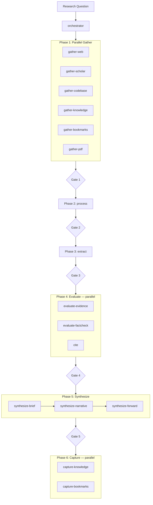

# danieldekay/deep-research

Modular multi-agent deep research pipeline. 18 agents across 6 phases with parallel execution, quality gates, evidence evaluation, citation management, and knowledge capture. All settings controlled via `config.toml`.

## Pipeline



## Install

```bash
apm install danieldekay/deep-research
```

## Usage

Start via the orchestrator agent:

```
@workspace /agent orchestrator <your research question>
```

Select **Claude Sonnet 4.6** (or higher) for the orchestrator call — this sets the model ceiling for all subagents. See [docs/model-routing.md](docs/model-routing.md).

## Configuration

Edit `config.toml` to customize the pipeline — no agent file changes needed:

```toml
[gather]
web       = true    # enable/disable each gather track
scholar   = true
codebase  = true
knowledge = true
bookmarks = true
pdf       = false   # opt-in (off by default)

[synthesis]
brief     = true
narrative = true
forward   = true

[capture]
knowledge = true
bookmarks = true
```

Full reference: all sections and their options are documented inline in `config.toml`.

## Agents (18)

| Agent | Phase | Description |
|---|---|---|
| `orchestrator` | all | Master coordinator — reads `config.toml`, dispatches all phases |
| `gather-web` | 1 | Web search track (Tavily) |
| `gather-scholar` | 1 | Academic search (Semantic Scholar) |
| `gather-codebase` | 1 | Local workspace search |
| `gather-knowledge` | 1 | Zettelkasten / knowledge DB |
| `gather-bookmarks` | 1 | Saved bookmark search |
| `gather-pdf` | 1 | PDF download + extraction (opt-in) |
| `explore-knowledge` | 1 | Deep Zettelkasten traversal + linking |
| `process` | 2 | Deduplicate, quality-rate, triage sources |
| `extract` | 3 | Per-source deep read (Keshav 3-pass / AIC) |
| `evaluate-evidence` | 4 | Claims map + contradiction detection |
| `evaluate-factcheck` | 4 | CRAAP scoring + fact-check verdicts |
| `cite` | 4 | BibTeX + reading list |
| `synthesize-brief` | 5 | Executive summary |
| `synthesize-narrative` | 5 | Full research narrative |
| `synthesize-forward` | 5 | Hypotheses, open questions, further research |
| `capture-knowledge` | 6 | Persist to knowledge DB |
| `capture-bookmarks` | 6 | Archive sources to bookmark service |

## Skills (4)

| Skill | Description |
|---|---|
| `deep-research` | Pipeline methodology — search strategies, evidence hierarchy, extraction methods |
| `scientific-brainstorming` | Hypothesis generation + ideation |
| `scientific-critical-thinking` | Evidence evaluation + methodology critique |
| `zettelkasten-management` | Knowledge DB management |

## Instructions (10)

`artifact-schema`, `citation-format`, `configuration-reference`, `evidence-evaluation`, `fact-check`, `gate-checks`, `quality-gates`, `source-quality`, `synthesis-narrative`, `system-research`

## Session Output

Each run creates a session folder in `notes/research/{date}-{slug}/`:

```
session-folder/
├── state.md              ← IPC tracking
├── session-log.md        ← phase execution log
├── session-manifest.md   ← artifact inventory
├── brief.md              ← executive summary
├── narrative.md          ← full narrative
├── sources/              ← register, coverage, discarded
├── extractions/          ← per-source deep reads
├── evidence/             ← claims-map, CRAAP, fact-check, contradictions
├── forward/              ← hypotheses, open-questions, further-research
├── references/           ← citations.bib, reading-list.md
└── diagrams/             ← optional
```

Templates for each artifact are in `templates/`.

## Docs

- [Architecture](docs/architecture.md) — pipeline phases, diagram, gate criteria
- [Model Routing](docs/model-routing.md) — ceiling rule, per-agent model assignments
- [Skills vs Agents](docs/skills-vs-agents.md) — when to use which

## License

MIT — Daniel de Kay
