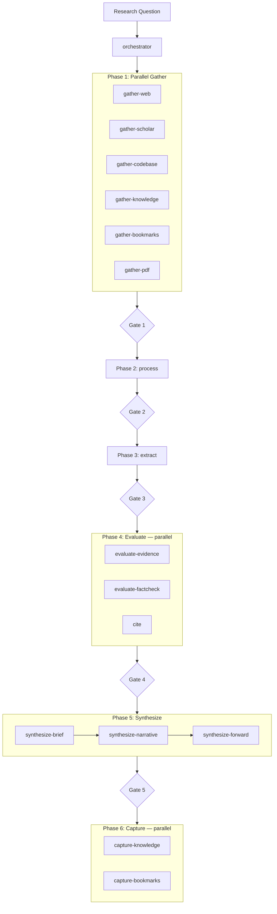

# Pipeline Architecture Reference

---

## 1. Overview

A single, config-driven 6-phase pipeline. 18 agents, 4 skill bundles, 10 instruction files. Phases 1 (Gather), 4 (Evaluate), and 6 (Capture) run tracks **in parallel**. Phases 2 (Process), 3 (Extract), and 5 (Synthesize) run **sequentially**. Quality gates enforce minimum standards before each phase transition. The orchestrator is a pure coordinator — it never does research work itself.

All pipeline settings are controlled via `config.toml` in the repo root. Toggle gather tracks, synthesis steps, capture steps, quality gate thresholds, model assignments, and provider settings — no agent file changes needed.

---

## 2. Pipeline Diagram



Disabled tracks (via `config.toml`) are silently skipped — gate thresholds adjust automatically.

Every pipeline run creates a session folder with this layout:

```
session-folder/
├── state.md              ← IPC tracking (updated after each phase)
├── log.md                ← phase execution log
├── brief.md              ← executive summary (synthesize-brief output)
├── narrative.md          ← full research narrative (synthesize-narrative output)
├── manifest.md           ← session inventory
├── tracks/               ← raw gather outputs (preserved for audit)
├── sources/              ← source register, coverage map, discarded list
├── extractions/          ← per-source deep read files
├── evidence/             ← claims-map, CRAAP scores, fact-check, contradictions
├── forward/              ← hypotheses, open-questions, further-research
├── references/           ← citations.bib, reading-list.md
└── diagrams/             ← optional (draw.io, generated on request only)
```

---

## 4. Agent-to-Phase Mapping

| Phase | Agent(s) | Execution |
|---|---|---|
| **Phase 1 — Gather** | `gather-web`, `gather-scholar`, `gather-codebase`, `gather-knowledge`, `gather-bookmarks` | Parallel |
| **Phase 2 — Process** | `process` | Sequential |
| **Phase 3 — Extract** | `extract` | Sequential |
| **Phase 4 — Evaluate** | `evaluate-evidence`, `evaluate-factcheck`, `cite` | Parallel |
| **Phase 5 — Synthesize** | `synthesize-brief` → `synthesize-narrative` → `synthesize-forward` | Sequential, then `synthesize-forward` can run in parallel after `synthesize-narrative` |
| **Phase 6 — Capture** | `capture-knowledge`, `capture-bookmarks` | Parallel |

The orchestrator reads `config.toml` at startup to load gate criteria and plugin/track configuration, then coordinates all phases without doing any research work itself.

---

## 5. Quality Gates

Gates block phase transitions. Each gate has defined criteria; failure triggers a retry or warning.

| Gate | Name | Key Criteria | On Fail |
|---|---|---|---|
| **Gate 1** | Source Sufficiency | ≥15 sources, ≥3 categories, all dimensions covered | Retry gather (max 2x) |
| **Gate 2** | Source Quality | Source register complete, ≥3 Tier 1/2 sources, duplicates removed | Retry process (max 1x) |
| **Gate 3** | Extraction Completeness | All Tier 1–3 sources extracted, PDFs analyzed | Retry extract (max 1x) |
| **Gate 4** | Evaluation Completeness | Claims map created, citations generated, fact-check verdicts present, contradictions identified | Warn and continue (no retry) |
| **Gate 5** | Output Completeness | `brief`, `evidence/claims-map`, `forward/open-questions`, `forward/hypotheses`, `forward/further-research`, `manifest` all present; narrative has inline citations | Retry synthesize (max 1x) |

---

## 6. Subagent Depth Limit

**Subagents cannot spawn their own subagents.** The pipeline is exactly one level deep:

```
User → Orchestrator → [subagents]
                        └── no further dispatch allowed
```

The orchestrator dispatches all workers directly. If a worker agent tried to invoke another subagent, Copilot would not allow it (the depth limit is enforced by the platform). Design any additional logic as instructions within the worker agent itself, not as further delegation.
